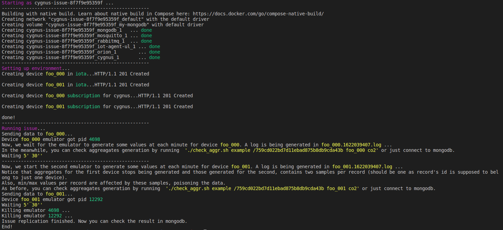

# cygnus-issue-8f7f9e95359f

Cygnus seems to be mixing data from differents devices when generates aggregates through STH_Commet sink.

- `data_model = dm-by-service-path`
- Cygnus issue: https://github.com/telefonicaid/fiware-cygnus/issues/2048

# Requirements
- bash
- docker
- docker-compose
- python3

# Usage

Execute `$ ./start.sh` to watch the issue. It takes around 12 minutes to complete. At the end, you should see something like this in the terminal:

Once the script is completed, you can check the results in mongodb or by running:
 - `$ ./check_aggr.sh example /759cd022bd7d11ebad875b8db9cda43b foo_000 co2`
 - `$ ./check_aggr.sh example /759cd022bd7d11ebad875b8db9cda43b foo_001 co2`

You should observe that `foo_000` aggregates generation stops when `foo_0001` emulators starts sending data. Also, offsets in the second device register more samples than expected and wrong `min/max`, as if cygnus where mixing data between devices.

You can reset the issue by executing `$ ./remove.sh` and executing `$ ./start.sh` again. **Be careful** of emulator not killed by the scrips as they run in the background and could poison the test.

You can also use:
- `$ ./remove.sh` to stop and remove the containers and volumes (be careful if you have volumes named after `cygnus-issue-8f7f9e95359f` )
- `$ ./setup.sh` to setup containers after running manual `docker-compose up`.
- `$ ./run.sh` to execute the issue secction.
- `$ ./check_aggr.sh example /759cd022bd7d11ebad875b8db9cda43b foo_000 co2` to check aggregates generation.

# Queries:
- device foo_000: `db.getCollection('sth_/759cd022bd7d11ebad875b8db9cda43b.aggr').find({'_id.range': 'hour', '_id.resolution':'minute', '_id.entityId':'foo_000', '_id.attrName':'co2'}).pretty()`
- device foo_001: `db.getCollection('sth_/759cd022bd7d11ebad875b8db9cda43b.aggr').find({'_id.range': 'hour', '_id.resolution':'minute', '_id.entityId':'foo_001', '_id.attrName':'co2'}).pretty()`
